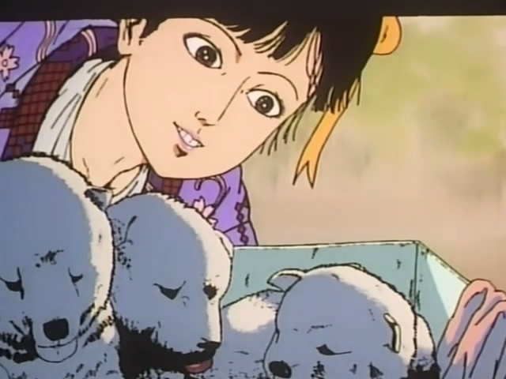

# Horror - Grotesque Art



## About the Project

This is a simple static website that I created years ago during my first encounter with coding. The site is built using only HTML and CSS and showcases my initial exploration into web development. The theme of the site revolves around the art of horror, with a focus on grotesque and unsettling manga.

## Features

- **Static Site**: Built using pure HTML and CSS.
- **Thematic Focus**: Explores horror manga, specifically the works of Suehiro Maruo and Junji Ito.
- **Simple Layout**: A straightforward layout with images and textual content.
- **First Project**: This project represents my first steps into the world of coding and web design.

## Content Overview

### Header

The header of the site includes an image and a title:

- **Title**: "The Art of Grotesque Horror"
- **Header Image**: A visual introduction to the theme of the website.

### Posts

The main section of the site is dedicated to posts about horror manga:

- **Manga Post**: Discusses the works of Suehiro Maruo and Junji Ito, two masters of horror manga.
  - **Images**: The post includes images such as "Tomie" and "The Laughing Vampire" to illustrate the content.
  - **Content**: The text describes the unique styles of both Maruo and Ito, highlighting their contributions to the horror genre.

## Technologies Used

- **HTML5**
- **CSS3**

## Future Improvements

While this project serves as a foundational step in my web development journey, there are several areas where it could be enhanced in the future. Potential improvements include:

- **User Authentication**: Implementing a login system to manage user access and personalization.
- **Animations**: Adding CSS animations to enhance the visual appeal and interactivity of the site.

These enhancements could further enrich the user experience and functionality of the site.


## How to Run the Project

1. Clone the repository:
   ```bash
   git clone https://github.com/your-username/horror-grotesque-art.git

